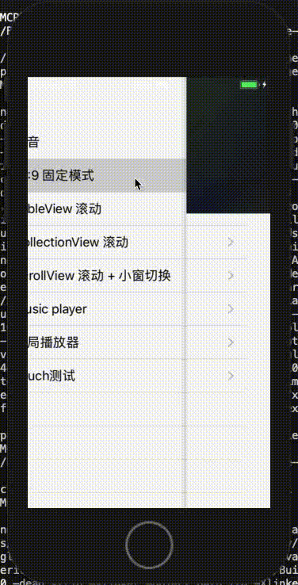

# MCPlayerKit

## MCPlayerKit 介绍

从事移动端开发以来，一直在做音视频类的开发，苹果的播放器基本定制型太强，需要定制在开源有kxmovie，授权的vitamio等，但层次不一，经过几年的发展，尤其是在这两年直播等投资热的趋势下，音视频技术逐渐趋于成熟，随便找几个库就能解决燃眉之急，开源的力量更进一步的推进了技术的发展，我也想写个简单的项目，写出一些心得。


[MCPlayerKit](https://github.com/poholo/MCPlayerKit) 是基于AVPlayer和IJKPlayer做的一款播放内核播放模块，做IJKPlayer支持是因为AVPlayer对于一些格式协议的支持的补充，比如flv、RTMP等。
[MCPlayerKit/GeneralPlayerUI]是一套基于MCPlayerKit高度封装16:9模式的播放UI，可以通过MCStyle样式完全自定图标、部分custom区域等。
## 特点
```text
MCPlayerKit
- PlayerKit高度抽象出播放层和渲染层
- 耦合低，使用方便
- support IJK & AVPlayer

GeneralPlayerUI
- 旋转
- support 2018 Devices
- loading
- 播放中断重试
- 用户可以自定义UI颜色、样式、字体大小
- 自定义topRightView
```

## Installation

#### Installation with CocoaPods

To integrate MCPlayerKit into your Xcode project using CocoaPods, specify it in your Podfile:
如果纯使用MCPlayerKit播放功能，请用
```text
pod 'MCPlayerKit/Core' or pod 'MCPlayerKit'
```

如果需要使用高度通用UI的，可以用
```text
pod 'MCPlayerKit/GeneralPlayerUI'

```
```text
GeneralPlayerUI 样式依赖于'MCStyle'，Example/Classes/Modules/GeneralPlayer/MCPlayerGeneralController有他的详细使用,
你可以通过json配置GeneralPlayerUI颜色、样式、字体等。
```

Run `pod install`


## 使用方法


### 1. 纯播放功能，自定义UI

#### 1.1 功能
```text
    a. support AVPlayer & IJKPlayer
    b. 统一渲染页面
```

#### 1.2 接入代码
```
- (MCPlayerKit *)playerKit {
    if (!_playerKit) {
        _playerKit = [[MCPlayerKit alloc] initWithPlayerView:self.playerView];
        _playerKit.playerCoreType = MCPlayerCoreAVPlayer;
        _playerKit.playerStatusDelegate = self;
    }
    return _playerKit;
}

//自定义渲染界面
- (MCPlayerView *)playerView {
    if (!_playerView) {
        CGFloat width = MIN([UIScreen mainScreen].bounds.size.width, [UIScreen mainScreen].bounds.size.height);
        CGFloat height = width * 9 / 16.0f;
        _playerView = [[MCPlayerView alloc] initWithFrame:CGRectMake(0, 0, width, height)];
    }
    return _playerView;
}
[self.playerKit playUrls:@[@"http://aliuwmp3.changba.com/userdata/video/45F6BD5E445E4C029C33DC5901307461.mp4"]];
```

### 2.GeneralPlayerUI 通用播放器UI 
#### 2.1 功能
```text
    a. 旋转
    b. support 2018 Devices
    c. loading
    b. 播放中断重试
    c. 用户可以自定义UI颜色、样式、字体大小
    e. 自定义topRightView
TODO:
    I. 投屏UI
```

#### 2.2 接入代码
```objectivec
    //颜色配置
    [MCStyleManager share].colorStyleDataCallback = ^NSDictionary *(void) {
        NSString *path = [[NSBundle mainBundle] pathForResource:@"CustomPlayerColor" ofType:@"json"];
        NSError *error;
        NSDictionary *dictionary = [NSJSONSerialization JSONObjectWithData:[NSData dataWithContentsOfFile:path] options:NSJSONReadingMutableContainers error:&error];
        NSAssert(!error, @"read json file error");
        return dictionary[@"data"];
    };

    //字体样式配置
    [MCStyleManager share].fontStyleDataCallBack = ^NSDictionary *(void) {
        NSString *path = [[NSBundle mainBundle] pathForResource:@"CustomPlayerFont" ofType:@"json"];
        NSError *error;
        NSDictionary *dictionary = [NSJSONSerialization JSONObjectWithData:[NSData dataWithContentsOfFile:path] options:NSJSONReadingMutableContainers error:&error];
        NSAssert(!error, @"read json file error");
        return dictionary[@"data"];
    };

    //图片等配置
    [MCStyleManager share].styleDataCallback = ^NSDictionary *(void) {
        NSString *path = [[NSBundle mainBundle] pathForResource:@"CustomPlayerStyle" ofType:@"json"];
        NSError *error;
        NSDictionary *dictionary = [NSJSONSerialization JSONObjectWithData:[NSData dataWithContentsOfFile:path] options:NSJSONReadingMutableContainers error:&error];
        NSAssert(!error, @"read json file error");
        return dictionary[@"data"];
    };
    [[MCStyleManager share] loadData];

    [self.view addSubview:self.playerView];
    [self.playerView updatePlayerPicture:@"https://avatars0.githubusercontent.com/u/3861387?s=460&v=4"];
    [self.playerView updateTitle:@"Skipping code signing because the target does not have an Info.plist file. (in target 'App')"];
//    [self.playerKit playUrls:@[@"http://aliuwmp3.changba.com/userdata/video/45F6BD5E445E4C029C33DC5901307461.mp4"]];
    [self.playerKit playUrls:@[@"http://aaaaaliuwmp3.changba.com/userdata/video/45F6BD5E445E4C029C33DC5901307461.mp4"]];
    [self.playerView updateAction:self.playerKit];
    self.playerView.retryPlayUrl = ^NSString *(void) {
        return @"http://aliuwmp3.changba.com/userdata/video/45F6BD5E445E4C029C33DC5901307461.mp4";
    };
    
    - (MCPlayerKit *)playerKit {
        if (!_playerKit) {
            _playerKit = [[MCPlayerKit alloc] initWithPlayerView:self.playerView.playerView];
            _playerKit.playerCoreType = MCPlayerCoreAVPlayer;
        }
        return _playerKit;
    }
    
    - (MCPlayerGeneralView *)playerView {
        if (!_playerView) {
            CGFloat width = MIN([UIScreen mainScreen].bounds.size.width, [UIScreen mainScreen].bounds.size.height);
            CGFloat height = width * 9 / 16.0f + [MCDeviceUtils xTop];
            _playerView = [[MCPlayerGeneralView alloc] initWithFrame:CGRectMake(0, 0, width, height)];
        }
        return _playerView;
    }
    
    具体参照 Example/Classes/Modules/GeneralPlayer/MCPlayerGeneralController
```


#### 2.2.0 style
使用参照 MCStyle
```text
播放页样式颜色
{
  "success": true,
  "data": {
    "player_title_color": "#ffffff",
    "player_time_color": "#ffffff",
    "player_progress_color": "#5cc0f2",
    "player_progress_buffer_trackcolor": "#97a2a8",
    "player_progress_buffer_color": "#737b80",
    "player_circle_progress_track_color": "#ffffff",
    "player_terminal_bgcolor": "#edf1f5",
    "player_terminal_titlecolor": "#999999",
    "player_terminal_mentioncolor": "#666666",
    "player_terminal_mentioncolor_alert": "#76bdff"
  }
}
```

#### 2.2.1 自定义播放器headerView右侧view
```objectivec
{
        MCPlayerCommonButton *btn = [MCPlayerCommonButton new];
        [btn setTitle:@"清晰度1" forState:UIControlStateNormal];
        [btn setBackgroundColor:[UIColor orangeColor]];
        btn.size = CGSizeMake(60, 30);
        btn.tag = 99;
        [self.playerView.topView.rightView addCustom:btn];
        btn.titleLabel.font = [UIFont systemFontOfSize:12];
    }
    具体参照MCPlayerCommonButton.h 注释
```

#### 2.2.2 释放问题
```objectivec
self.playerView.outEventCallBack = ^id(NSString *action, id value) {
    __strong typeof(weakSelf) strongSelf = weakSelf;
    if([action isEqualToString:kMCPlayerDestory]) {
        [strongSelf destory];
    }
    return nil;
};

- (void)destory {
    if(_playerView) {
        [_playerView removeFromSuperview];
        _playerView = nil;
    }
    if(_playerKit) {
        [_playerKit destory];
        _playerKit = nil;
    }
}


```


### 2.3 Screenshot


## 类结构
```
PlayerKit --------------- 播放器核心，AVPlayer与IJKPlayer抽象
    -- Core               Player抽象与实现以及PlayerKit播放器控制
    -- Extend             辅助类
    -- PlayerView         播放器界面父类，Custom播放器界面View必须继承与此类
    
GeneralPlayerUI----------- 通用播放组件UI
    -- Views               通用UI subviews
    -- MCPlayerGeneralView 通用播放界面

Commen ------------------- 通用类

```


## more

此项目会作为长期维护项目，接受各位指导。

## support
Tanks JetBrains AppCode
[Download JetBrains Develop Tools](https://www.jetbrains.com/?from=MCPlayerKit)

## License

These PlayerKit are available under the MIT license.
